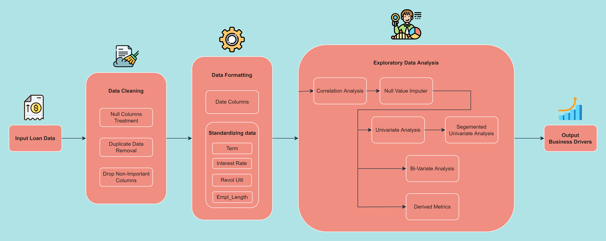
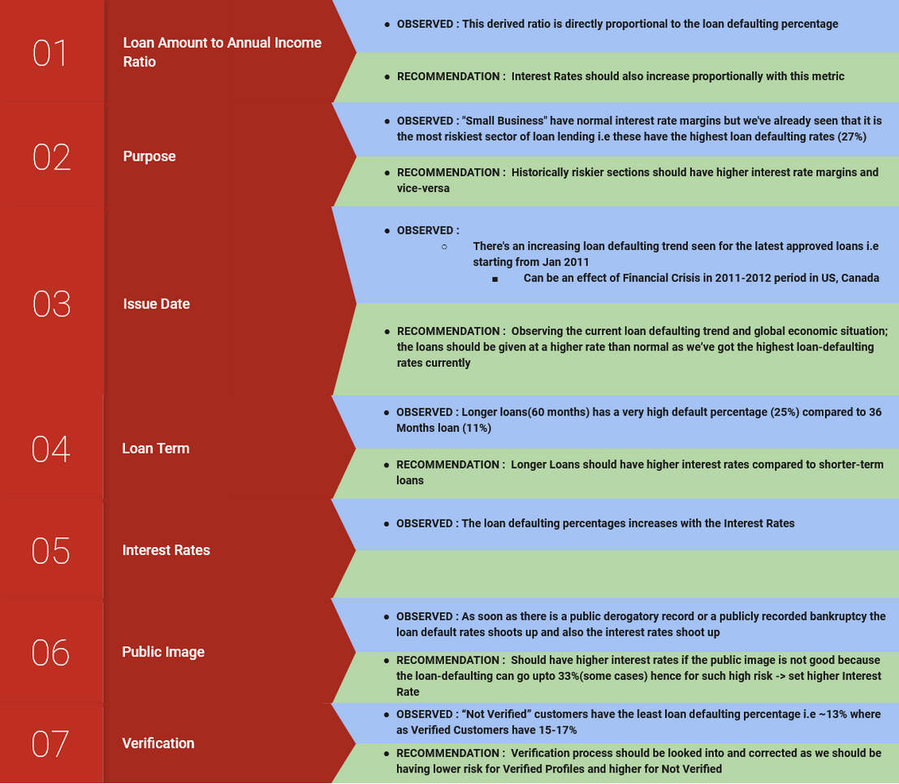

# Lending-Club-Case-Study
> Our team's solution to the Lending Club Case Study

## Table of Contents
* [Problem Statement](#problem-statement)
* [Solution Flow](#solution-flow)
* [Solution Content](#solution-content)
* [Conclusions](#conclusions)
* [Technologies Used](#technologies-used)

<!-- You can include any other section that is pertinent to your problem -->

## Problem Statement

Historical Loan Data provided

**GOAL** :
1. Identify profit-makers and loss-making sectors
2. Analyse the data and make business decisions which drives the business to make more profits and reduce losses

## Solution Flow

## Solution Content

Important solution content : 

1. [EDA Notebook](Group_Facilitator_Nitin_Kumar.ipynb) : The full Exploratory Data Analysis notebook which contains all the analysis done
2. [Final Presentation](EDA-results.pdf) : The presentation in a pdf format (short version) (this doesn't contain the appendix plots)
3. [Final Presentation-long](EDA-results.pptx) : The full presentation which contains all the plots and analysis (long version)

## Conclusions

## Technologies Used
1. Plotly==5.3.1
2. Pandas==1.2.4
3. Numpy==1.22.3

## Contact
Created by [@kranthik13][@ns7893985] - feel free to contact us!
